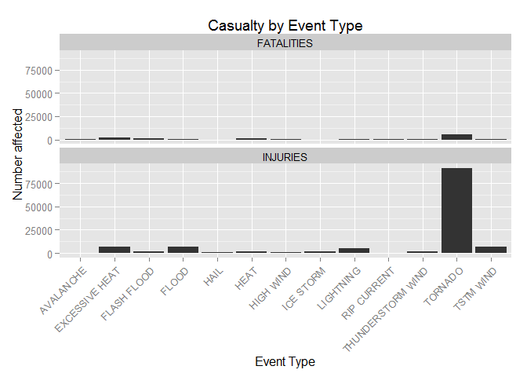
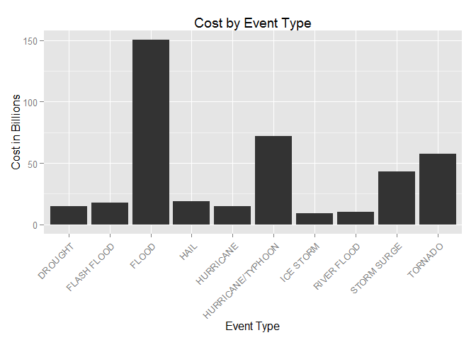

# NOAA Storm Data Analysis
Jacob Townson  
July 18, 2015  


# Synopsis

We were given an assignment to do some analysis on data from the NOAA Storm Database. The assignment asks us to answer two questions, which types of events are most harmful to population health, and which types of events have the greatest economic consequences. I begin by doing the processing of the data, where I read it into R then make it usable to do analysis on. Then in the results, I will look at the data and find correlations in the data to answer the given questions from the assignment. When processing the data, I chose to take some variables out, and I explain why in the Section. 

# Data Processing

## Reading in the Data

To begin, I must read in the data to work with in R. To do that, I used following the code below. 


```r
stormData <- read.csv(bzfile("repdata-data-StormData.csv.bz2"))
```

## Organizing the Data

After making the data frame, I chose to take some variables out that don't help to answer the questions given to us like dates, times, and reference numbers. The reason I chose to take out time (because one would think it would be important) is because the time intervals weren't complete for all of the values. For example, the event at reference 1 had a beginning time but not an ending one. Thus, I made the judgement that time probably shouldn't be in this analysis. 


```r
stormData <- select(stormData, STATE, EVTYPE, LENGTH, WIDTH, FATALITIES, 
                    INJURIES, PROPDMG, PROPDMGEXP, CROPDMG, 
                    CROPDMGEXP, REMARKS)
head(stormData)
```

```
##   STATE  EVTYPE LENGTH WIDTH FATALITIES INJURIES PROPDMG PROPDMGEXP
## 1    AL TORNADO   14.0   100          0       15    25.0          K
## 2    AL TORNADO    2.0   150          0        0     2.5          K
## 3    AL TORNADO    0.1   123          0        2    25.0          K
## 4    AL TORNADO    0.0   100          0        2     2.5          K
## 5    AL TORNADO    0.0   150          0        2     2.5          K
## 6    AL TORNADO    1.5   177          0        6     2.5          K
##   CROPDMG CROPDMGEXP REMARKS
## 1       0                   
## 2       0                   
## 3       0                   
## 4       0                   
## 5       0                   
## 6       0
```

The next thing I need to do is to change the damage prices to be the full numbers. If you look at the first few examples, you'll see that the prices are recorded as single digits, then what they are multiplied by $1000$ if the *EXP* is $K$, $1000000$ if it is $M$, and a billion if it is $B$. **NOTE: If you run the following code, it will take some time to run because the data is so large.**


```r
for(i in 1:length(stormData$PROPDMG)){
  if(stormData$PROPDMGEXP[i] == "K"){
    stormData$PROPDMG[i] <- stormData$PROPDMG[i]*1000
  }
  if(stormData$PROPDMGEXP[i] == "M"){
    stormData$PROPDMG[i] <- stormData$PROPDMG[i]*1000000
  }
  if(stormData$PROPDMGEXP[i] == "B"){
    stormData$PROPDMG[i] <- stormData$PROPDMG[i]*1000000000
  }
  if(stormData$CROPDMGEXP[i] == "K"){
    stormData$CROPDMG[i] <- stormData$CROPDMG[i]*1000
  }
  if(stormData$CROPDMGEXP[i] == "M"){
    stormData$CROPDMG[i] <- stormData$CROPDMG[i]*1000000
  }
  if(stormData$CROPDMGEXP[i] == "B"){
    stormData$CROPDMG[i] <- stormData$CROPDMG[i]*1000000000
  }
}
```

Now that I have given all of the damage costs real values rather than abbreviated ones, we can move on with cleaning the data. To make our final data frame for analysis, I have chosen to subset the data a little bit more so that we can group things together and take the sum of every column.


```r
smaller <- select(stormData, EVTYPE, LENGTH, WIDTH, FATALITIES, INJURIES, 
                  PROPDMG, CROPDMG)

dataSum <- smaller %>% group_by(EVTYPE) %>% summarise_each(funs(sum))
```

This data is much more simplified, however, after looking into it, there are still a large number of repeated EVTYPE values that come from typos and other human related errors when adding data into the data frame. However, after looking at the data, this shouldn't affect our overall outcome of the most effective things. The last thing we must do then is to add the columns of property damage and crop damage together. By doing this, we will be able to see the total cost that these natural disasters cause.


```r
dataSum$PROPDMG <- dataSum$PROPDMG + dataSum$CROPDMG
finalData <- select(dataSum, EVTYPE, FATALITIES, INJURIES, PROPDMG)
```

And now that we have the completely watered down data frame to use, we can start looking at the results.

# Results

To begin, let's look at a plot of the harm to humanity that these natural disasters cause through fatality and injury. To do this, let's look at the EVTYPE values with the highest percentage of fatalities and injuries.


```r
total <- finalData[finalData$FATALITIES > quantile(finalData$FATALITIES,
                                                   probs=0.99) |
                    finalData$INJURIES > quantile(finalData$INJURIES,
                                                  probs=0.99),]
    
summary <- melt(total, id=c("EVTYPE"),
                measure.vars=c("FATALITIES","INJURIES"))
```

And finally make a plot using this newly found data.


```r
g <- ggplot(summary, aes(x=EVTYPE, y=value))
g <- g + geom_bar(stat="identity")
g <- g + labs(x = "Event Type") 
g <- g + labs(y = "Number affected")
g <- g + labs(title="Casualty by Event Type")
g <- g + facet_wrap( ~ variable, ncol=1)
g <- g + theme(axis.text.x=element_text(angle=45,vjust=1,hjust=1))
print(g)
```

 

As we can see from both sections of this figure, it would appear that tornadoes cause both the most injuries and the most fatalities in the United States. It surprises me that hurricanes don't appear on this graph, but this could have to do with the poor methods of taking data in the original data file.

And now let's look at the damage costs and which storms have costed the most.


```r
g <- ggplot(finalData[finalData$PROPDMG > quantile(finalData$PROPDMG,
                                                   probs=0.99),],
            aes(x=EVTYPE, y=PROPDMG/10^9))
g <- g + geom_bar(stat="identity")
g <- g + labs(x = "Event Type") 
g <- g + labs(y = "Cost in Billions")
g <- g + labs(title="Cost by Event Type")
g <- g + theme(axis.text.x=element_text(angle=45,vjust=1,hjust=1))
print(g)
```

 

When looking at this plot, it seems obvious that floods caused the most amount of cost damage. Thus we can conclude that based off of this data that floods have been the most expensive type of natural disaster.

# Conclusion

After much analysis and a lot of cleaning up of the data, one can see that tornadoes are the most harmful natural occurrences to human safety, and floods are the most costly. This surprised me on both fronts, because I would have expected that hurricanes would be the most harmful and the most costly. However I think that this problem is due to the poor data recording in the original data file. If the data were more regulated, I think it would have been more clear in the end. Also, it is important to note that the way I analyzed the data was by summing over time, not the mean damage cost or fatalities. This shows more of a long term effect rather than the average of all of them. So over the long term of the United States data recording, my answers are true. It could be argued that means would have been useful as well.


